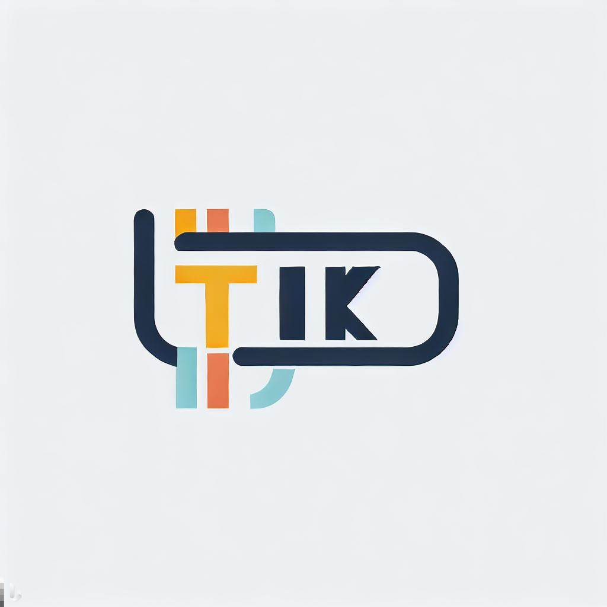

# Ecommerce

A comprehensive ecommerce system platform developed using Node.js and NextJs, orchestrated with Docker containers and Kubernetes. This platform aims to streamline ticket management through microservices architecture.

## Table of Contents

- [Features](#features)
- [Technologies](#technologies)
- [Getting Started](#getting-started)
- [Architecture](#architecture)
- [Usage](#usage)
- [Contributing](#contributing)
- [License](#license)

## Features

- User-friendly ticket creation and management.
- Microservices architecture for scalability and modularity.
- Docker containers for consistent deployment environments.
- Kubernetes orchestration for scaling and management.
- Ingress-nginx for routing and load balancing.

## Technologies

- Node.js: Backend development.
- React.js: NextJs Frontend user interface.
- Docker: Containerization of microservices.
- Kubernetes: Container orchestration.
- Ingress-nginx: Kubernetes Ingress Controller.

## Getting Started

Follow these instructions to set up and run the project locally for development or testing purposes. Make sure you have Docker and Kubernetes installed.

1. Clone the repository: `git clone https://github.com/edsphinx/ecommerce-microservices.git`
2. Navigate to the project folder: `cd ecommerce-microservices`
<!-- 3. [Add more setup steps as needed] -->

## Architecture

The project follows a microservices architecture to ensure scalability, modularity, and maintainability. Docker containers encapsulate each microservice, and Kubernetes manages container orchestration.

[diagram or explanation of the microservices architecture]

## Usage

<!-- [examples of how to use the project, such as API endpoints, UI interactions, etc.] -->

## Contributing

We welcome contributions from the community! To contribute to the project:

1. Fork the repository.
2. Create a new branch: `git checkout -b feature/your-feature-name`
3. Make your changes and commit them: `git commit -m "Add your changes"`
4. Push to the branch: `git push origin feature/your-feature-name`
5. Create a pull request.

Please ensure your contributions follow our [Code of Conduct](CODE_OF_CONDUCT.md).

## License

This project is licensed under the [MIT License](LICENSE).

---

For questions, feedback, or bug reports, contact [fonckdev@gmail.com].
